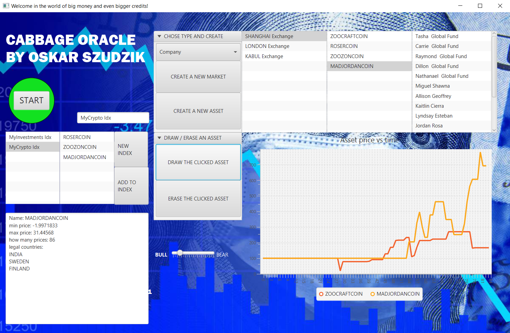

# Trading Simulator Application
## Object-Oriented Programming Project

## Author:
* *Oskar Szudzik 148245*

## Prerequisites

* Java 17+
* JavaFX

## How to run the program:
java --module-path "PATH_TO_JAVAFX_LIB" --add-modules javafx.controls,javafx.fxml -jar PATH_TO_PROJECT\TradingSimApp\out\artifacts\TradingSimApp_jar\TradingSimApp.jar Main

* To start please click "START" button (initial market is of type Currency). 
  Then you can pick any asset you want and draw it at the line chart on 
  the right side of the window or add more Markets/Assets. Adding a new Asset - 
  pick a Market from the first list, adjust proper type, click create button. 
  When you click something from the lists above the chart - short info about it 
  will appear in the text field.

## About the project:
* "The goal of the project is to create a market simulator. The main entities in
  this world are markets, indexes, companies, investors, funds, currencies, and 
  commodities." To achieve it I created a multi-threaded program with basic GUI
  which is simulating the behaviour of an "exchange world" in the object-oriented
  style. 
* User can create markets and assets, regulate the transaction rate, draw and erase
  companies, currencies and commodities.
* There is still room for optimizing some things and adding new ones. 
  However, because it is my first project of that scale I decided to 
  focus on the whole image of an application instead of optimizing single methods.

## Results and summary thoughts:
* I think that because of the scale of the project I learned how to think in
  object-oriented way. It was a great opportunity to learn Java through a systematic
  and exciting experience.

* I am proud of the work I did here. 

## Sources

* [I took some Investor names from this site](https://www.usna.edu/Users/cs/roche/courses/s15si335/proj1/files.php%3Ff=names.txt.html)
* [I also borrowed an image of mr Benjamin Franklin from this site](https://www.cumanagement.com/articles/2020/08/facing-finances-amidst-covid-19)